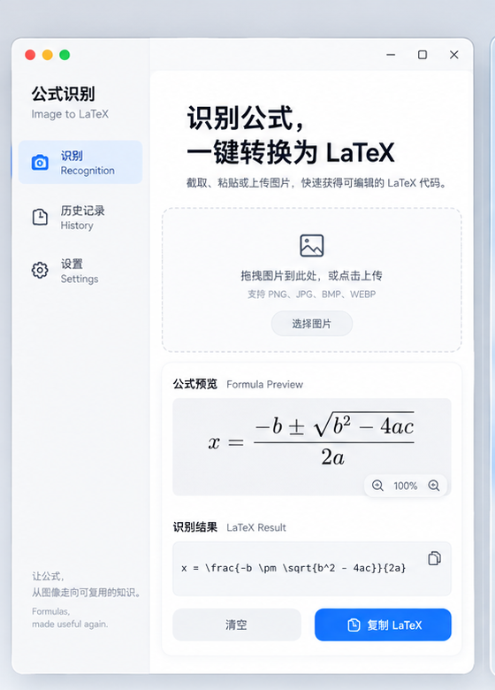

# FormulaClip

一个轻量的 Windows 公式截图工具：按快捷键框选公式，程序调用你自己的视觉模型，将结果转换为 LaTeX 并自动复制到剪贴板。

 

## 功能

- 默认按 `Shift + Space` 开始全局截图，可改为 `F1`、`Ctrl+Shift+S` 等组合。
- 点击快捷键栏旁的“录入”，直接按一次组合键即可设置，无需记忆快捷键格式。
- 截图完成后先显示简洁的“识别 / 取消”操作条，确认后请求模型并复制 LaTeX。
- 白色高 DPI 界面，适配高分辨率显示器。
- 关闭窗口后继续驻留 Windows 右下角托盘；托盘菜单可重新打开或退出程序。
- 支持开机自启动、识别历史记录、历史保留数量和识别完成通知开关；设置页使用 Apple 风格开关，历史页使用图片卡片。
- 使用 Formula Clip 蓝色公式图标，窗口、EXE 和托盘统一显示。
- 接口类型预设：OpenAI、DeepSeek、Sub2API，以及任意 OpenAI 兼容服务。
- 通过 `/v1/models` 获取模型列表，并用可编辑下拉框选择模型；也可以直接输入模型名。
- API Key 保存在当前 Windows 用户的配置目录，不会写入项目或 Git 仓库。

## 使用前准备

1. Windows 10 或 Windows 11。
2. Python 3.10 及以上版本。安装时勾选 **Add Python to PATH**。
3. 一个支持图片输入（视觉）的 OpenAI 兼容模型和 API Key。

> 文字模型无法读取截图。模型列表中出现某个模型不代表它支持视觉能力，请以你的服务商文档为准。

## 从源码运行

在 PowerShell 中执行：

```powershell
git clone https://github.com/Uporonier/FormulaClip.git
cd FormulaClip
python -m venv .venv
.\.venv\Scripts\Activate.ps1
python -m pip install --upgrade pip
python -m pip install -r requirements.txt
python main.py
```

如果 PowerShell 拒绝激活虚拟环境，可只对当前窗口执行：

```powershell
Set-ExecutionPolicy -Scope Process Bypass
```

然后再次运行 `.\.venv\Scripts\Activate.ps1`。

## 首次配置

打开程序后依次填写：

| 字段 | 说明 | 示例 |
| --- | --- | --- |
| 接口类型 | 用来快速填充常见服务的 API 地址 | `Sub2API` / `OpenAI` / `DeepSeek` |
| API 地址 | OpenAI 兼容 API 的 `/v1` 根地址 | `http://127.0.0.1:8080/v1` |
| API 密钥 | 服务商创建的 API Key | `sk-...` |
| 视觉模型 | 能接受图片输入的模型 ID | 从“获取模型”下拉框中选择 |
| 截图快捷键 | 全局唤起截图 | `Shift+Space` |

填写地址和密钥后，点击 **获取模型**。程序会请求 `GET /v1/models`，将返回的模型显示在“视觉模型”下拉框中。选择支持图片输入的模型，点击 **保存配置**。

如需更改截图快捷键，点击快捷键栏右侧的 **录入**，再按下目标组合键，例如 `F1`、`Shift+Space` 或 `Ctrl+Shift+S`，最后点击“保存配置”。

## 各服务配置示例

### 本机 Sub2API

先启动 Sub2API 后，在 FormulaClip 中填写：

```text
接口类型：Sub2API
API 地址：http://127.0.0.1:8080/v1
API 密钥：在 Sub2API 后台创建的 Key
```

点击“获取模型”，再选择可处理图片的模型。

### OpenAI

```text
接口类型：OpenAI
API 地址：https://api.openai.com/v1
API 密钥：你的 OpenAI API Key
```

选择支持图片输入的模型，例如你的账号可用的视觉模型。

### DeepSeek

```text
接口类型：DeepSeek
API 地址：https://api.deepseek.com/v1
API 密钥：你的 DeepSeek API Key
```

DeepSeek 的模型能力会随产品版本变化；只有服务商明确支持图片输入的模型才能用于公式识别。

### 其他 OpenAI 兼容服务

选择 `OpenAI 兼容`，手动填写该服务提供的 `/v1` 地址、密钥和视觉模型名即可。

## 识别公式

1. 在论文、网页、PDF 或图片中定位公式。
2. 按 `Shift + Space`，主窗口会暂时隐藏。
3. 拖拽鼠标框选公式；按 `Esc` 可以取消。
4. 程序自动调用模型。完成后，LaTeX 会显示在结果框并自动复制。
5. 在 Word、Obsidian、Markdown 编辑器或 LaTeX 编辑器中直接按 `Ctrl + V` 粘贴。

## 设置与托盘

打开“设置”页可以配置：

- 开机自动启动；
- 是否保留截图和 LaTeX 历史；
- 历史最多保留 20、50、100、200 条或不限制；
- 识别成功后是否显示右下角 1.5 秒通知。

点击窗口右上角关闭按钮只会隐藏界面，程序仍会监听快捷键。右下角隐藏图标中右键 Formula Clip，可以重新打开界面或选择“退出程序”彻底关闭。



当前 Windows 版本采用 A 方案的白色高 DPI 界面：左侧品牌栏保持完整显示，设置项使用蓝色切换开关，历史记录显示缩略图与 LaTeX 摘要，截图时使用深色遮罩和蓝色选框，确认按钮固定在选区下方。

## 配置保存位置

配置保存在：

```text
%LOCALAPPDATA%\FormulaClip\config.ini
```

文件包含 API Key，请不要将它提交到 Git、网盘公开分享，或发给他人。删除该文件即可重置应用配置。

## 打包为 EXE

安装额外的打包工具：

```powershell
python -m pip install pyinstaller
pyinstaller --noconfirm --clean --windowed --name FormulaClip main.py
```

生成的程序位于 `dist\FormulaClip\FormulaClip.exe`。必须保留同目录的 `_internal` 文件夹；不要单独移动 EXE。

## 常见问题

**点击“获取模型”失败**

确认 API 地址以 `/v1` 结尾，密钥有效，并检查服务是否支持 `GET /v1/models`。如果服务不提供模型列表，可直接手动输入视觉模型名。

**模型返回“图片中没有识别到公式”**

请让截图只包含公式，避免同时框入大段正文；提高截图清晰度，并确认所选模型支持图片输入。

**快捷键无效**

尝试以普通桌面程序方式启动，不要在某些安全隔离环境中运行；也可先点击窗口中的“开始截图”。更改快捷键后点击“保存配置”。

**复制结果后丢失**

结果已写入 Windows 剪贴板，但其他程序随后复制内容会覆盖它。识别完成后请尽快粘贴。

## 隐私

截图会发送到你在界面中配置的 API 服务进行识别。请不要上传包含机密、个人隐私或未经授权的数据。

## 开源许可

本项目当前未附带许可证。在添加许可证前，请勿假定其允许商业再分发。
